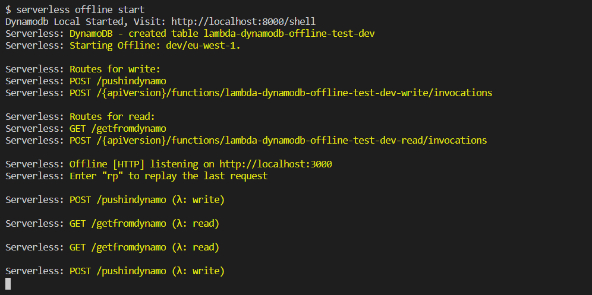
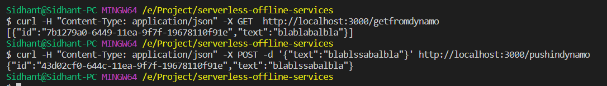
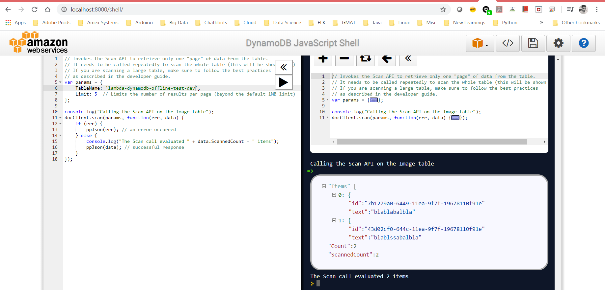

# How to use Serverless offline and serverless dynamodb local?

Are you trying to develop a serverless application and want to avoid unnecessary costs associated to services like lambdas, API gateways, dynamodb etc. Here is a deal with serverless, you can use two plugins listed below to ease out your development and avoid extra costs.

Plus it an be a good way to implement TDD.

**Well all of this requires you to have serverless installed and configured.**

    > serverless-offline
    > serverless-dynamodb-local

Add below packages in your dev dependencies and then run *npm install*

```
"devDependencies": {
    "serverless-dynamodb-local": "^0.2.39",
    "aws-sdk": "^2.140.0",
    "uuid": "^3.1.0",
    "serverless-offline": "^5.12.1"
  }
```
Once the above packages are installed, below steps must be performed.

    > serverless dynamodb install
    > serverless offline start

After triggering serverless offline start you will se that a local instance of dynamodb is started, the address/ URL will be (based on values specifed in serverless.yml under dynamodb custom):

http://localhost:8000/shell



Now, to access the dynamodb database we need to have lambda handlers, our handler.js uses aws-sdk to make connections to DB to get and post data into DB.

Also, once the environment variable(IS_OFFLINE) is set to true, the localhost is set as the URL for DB.

For the API gateway, serverless offline launches a webserver on local machine with the paths specifed for each events attached to lambda.

For e.g.: getfromdynamo, pushindynamo etc

These API paths are accessible on http://localhost:3000/getfromdynamo

Users can test the GET and POST methods by :

curl -H "Content-Type: application/json" -X POST -d '{"text":"blablabalbla"}' http://localhost:3000/pushindynamo

curl -H "Content-Type: application/json" -X GET  http://localhost:3000/getfromdynamo



And, another way to scan the table is using Dynamodb local shell.

You can use the test-scan.js and update the table name and upload in local shell to execute and see the results.

